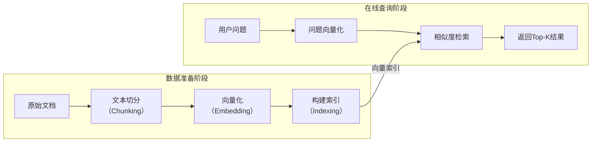

# 基础 RAG

文档解析、文档分块、文本嵌入、向量数据库、向量检索、提示词工程
常用文档格式:

* JSON
* Docx
* PDF
* CSV
* MarkDown
* HTML
* TXT
* XML


基础的数据向量化与索引，是RAG（检索增强生成）系统的"数据准备"阶段。这个阶段的目标很明确：**把你拥有的所有知识文档，转化成一种计算机能快速"查找"的格式**。

你可以把它想象成**为知识库建立一套智能的图书索引系统**。下面我把这个过程拆解为清晰的步骤，并解释背后的技术细节。

# 🗺️ 整体流程一览

整个过程可以分为两大阶段：

1.  **数据准备**：从原始文档到向量索引的构建。
2.  **在线查询**：用户提问时，如何快速找到相关答案。

这两个阶段的关系可以用下图来理解：



接下来，我们详细拆解"数据准备阶段"的每一个技术环节。

---
### 前置：文档解析

文档解析是构建RAG系统的第一步，也是决定整个系统效果的上限。它的核心任务是将非结构化的原始文档（如PDF、Word、扫描件、图片）转化为结构化的、机器可读的数据，为后续的文本切分、向量化和检索奠定基础。

详情查看[](SimpleRAG-docParse.md)


### 第一步：文本切分（Chunking）

#### 技术点拆解

| 概念 | 定义 | 基本原理 |
| :--- | :--- | :--- |
| **文本切分** | 将长文档（如PDF、Word）切分成较小的、独立的文本单元。 | 因为大语言模型有上下文窗口限制，且长文本向量检索精度会下降，所以需要把文档切分成合适的大小。 |
| **块（Chunk）** | 切分后的最小文本单元，后续将作为独立的向量进行索引和检索。 | 它是RAG系统中最基本的"知识颗粒"，检索时系统会返回最相关的块。 |
| **块大小（Chunk Size）** | 每个文本块允许包含的最大字符数或Token数。 | 决定了"知识颗粒"的粗细。块太小可能丢失上下文，块太大可能增加噪音。 |
| **块重叠（Chunk Overlap）** | 相邻两个文本块之间共享的字符数或Token数。 | 确保上下文在边界处不被切断，避免关键信息落在块的边缘而被忽略。 |

#### 三种常用的分块策略

| 策略 | 原理 | 优势 | 劣势 |
| :--- | :--- | :--- | :--- |
| **字符分块** | 按固定字符数切割，可指定分隔符（如换行符）。 | 实现简单，速度快。 | 容易切断句子或段落，破坏语义。 |
| **递归字符分块** | 使用从粗到细的分隔符列表（`\n\n` → `\n` → ` ` → `""`）递归切割。 | 在固定长度和语义完整性之间取得平衡，LangChain官方推荐。 | 仍然可能出现语义断裂，只是比普通字符分块好。 |
| **语义分块** | 先切分成句子，再计算句子间的语义相似度，将相似句子聚合在一起。 | 保持语义连贯性，检索精度高。 | 计算成本较高，需要额外的嵌入模型。 |

---
除了你提到的三种主流策略，RAG领域在实践和研究中还发展出了多种更精细或前沿的分块方法。下表梳理了其他几种代表性的策略及其特点：

### 📊 其他文本分块策略对比

| 分块策略 | 核心原理 | 主要优势 | 主要劣势 / 适用场景 |
| :--- | :--- | :--- | :--- |
| **基于Token的分块** | 严格按语言模型使用的Token数量进行切分。 | **精确控制Token消耗**，确保不超LLM的上下文窗口上限。 | 和字符分块类似，会**切断语义**；需引入重叠来缓解。 |
| **基于文档结构的分块** | 利用文档的固有结构（如段落、Markdown标题、HTML标签、代码函数）作为天然边界。 | **极好地保留了逻辑结构和上下文完整性**，对结构化文档（如技术文档、网页）非常有效。 | 需要针对不同文档格式（MD, HTML, JSON）定制解析器，通用性较低。 |
| **滑动窗口分块** | 在切分时，让相邻的两个块有**显著的重叠部分**，或者同时创建用于检索的小块和用于生成的大块（父子块）。 | **检索精度高（小块负责精确命中），生成上下文丰富（大块提供完整信息）**。 | 实现略复杂，需管理两层块的关系；可能增加存储和计算开销。 |
| **后期分块** | **先利用长上下文嵌入模型对整个文档生成包含上下文信息的向量，再进行文本切分**。 | **能避免在切分边界处丢失上下文信息**，特别适合处理有大量指代或交叉引用的文本。 | 依赖于支持长上下文的嵌入模型；技术上相对较新，生态支持不如传统方法广泛。 |
| **LLM引导的分块** | 使用大语言模型（LLM）本身来判断文本的语义边界，或生成主题一致的段落合并为“大块”。 | **理论上能实现最符合人类语义理解的分块**，质量非常高。 | **计算成本极其高昂，速度慢（比递归分块慢10-50倍）**，主要用于前沿研究。 |

### 💡 如何选择：一张核心决策表

面对这么多策略，选择的关键在于权衡**质量、速度和成本**。你可以参考这个表格：

| 你的首要目标 | 推荐策略 | 理由 |
| :--- | :--- | :--- |
| **快速验证，搭建原型** | **递归字符分块** | LangChain官方推荐起点，在大多数基准测试中，速度和效果平衡极佳，性能甚至优于昂贵的语义分块。 |
| **处理技术文档、网页** | **基于文档结构的分块** | 能完美保留标题、代码块等结构信息，对这类文档检索效果提升最明显。 |
| **提升复杂问答的上下文完整性** | **滑动窗口/父子块分块** | 实现了“精准检索”与“丰富上下文”的双赢，是生产环境中常用的优化手段。 |
| **追求极致的检索精度** | **后期分块 或 语义分块** | 前者能最大程度保留上下文，后者通过语义聚类确保块内主题高度一致，但两者都需接受较高的计算成本。 |

> **注意**：在学术研究中，分块策略和检索任务本身存在强关联。例如，有研究发现，对于文档内检索（如大海捞针）和文集内检索（标准信息检索）这两种不同任务，最优的分块策略可能截然不同。因此，在实际落地时，结合你的具体数据进行小规模实验评估，往往是做出最佳选择的可靠路径。

## 字符分块更多文档处理
## 递归字符分块更多文档处理

## 语义分块更多文档处理


## 基于Token的分块

基于Token的分块，可以理解为**从大语言模型（LLM）的视角出发来切分文本**。它的核心思想是，不以字符数，而是以模型真正处理的“词元”（Token）数量为计量单位来切割文本。这能让你精确控制送入模型的内容量，确保每个块都不会超出模型的上下文窗口限制。

### 💡 定义与基本原理

**什么是词元（Token）？**
词元是语言模型理解和生成文本时的**最小语义单元**，可以把它想象成一块块“积木”。它不等同于单词或字符，可能是一个完整的词（如“苹果”），也可能是词根或标点符号。这种切分方式能将人类语言转换成模型可以处理的数字编号。

> **官方术语说明**：根据大语言模型领域的通用标准和OpenAI等机构的官方定义，Token的标准中文译名为**词元**。

**基本原理**
1.  **选择分词器（Tokenizer）**：你需要使用与你的目标**嵌入模型**或**大语言模型**相配套的同一个分词器。例如，如果计划使用OpenAI的模型，通常会使用`tiktoken`这个分词器；如果使用开源的`Llama`模型，则需要用其对应的分词器。
2.  **设定词元块大小**：指定一个以词元数量为单位的块大小，如`chunk_size=512`。
3.  **切分过程**：分词器先将整段文本切分成一个词元序列，然后按顺序将这些词元“装箱”，每满512个词元就形成一个文本块。
4.  **处理重叠**：通常也会设置一个`chunk_overlap`（重叠词元数），让相邻的块共享一部分内容，以保持上下文的连贯性。

### 🐣 例子

假设我们有一段中文文本：
> “**检索增强生成技术结合了信息检索与大语言模型，能够有效减少模型产生幻觉的问题。**”

使用例如`tiktoken`这样的分词器后，这段文本可能会被切分为以下词元序列（为演示简化）：
`["检索", "增强", "生成", "技术", "结合", "了", "信息", "检索", "与", "大", "语言", "模型", "，", "能够", "有效", "减少", "模型", "产生", "幻觉", "的", "问题", "。"]`

如果我们设定**`chunk_size=8`，`chunk_overlap=0`**，切分结果将是：
*   **块 1**：`["检索", "增强", "生成", "技术", "结合", "了", "信息", "检索"]` → “检索增强生成技术结合了信息检索”
*   **块 2**：`["与", "大", "语言", "模型", "，", "能够", "有效", "减少"]` → “与大语言模型，能够有效减少”
*   **块 3**：`["模型", "产生", "幻觉", "的", "问题", "。"]` → “模型产生幻觉的问题。”

如果设定**`chunk_size=8`，`chunk_overlap=2`**，切分结果则会变成：
*   **块 1**：`["检索", "增强", "生成", "技术", "结合", "了", "信息", "检索"]` → “检索增强生成技术结合了信息检索”
*   **块 2**：`["信息", "检索", "与", "大", "语言", "模型", "，", "能够"]` → “信息检索与大语言模型，能够”
*   **块 3**：`["能够", "有效", "减少", "模型", "产生", "幻觉", "的", "问题"]` → “能够有效减少模型产生幻觉的问题”
*   **块 4**：`["幻觉", "的", "问题", "。"]` → “幻觉的问题。”

通过这个例子可以看到，重叠部分（如块1和块2共享了`信息检索`）有助于避免关键信息恰好被切在边界上而丢失上下文。

### 简单 Python 代码示例
```
import tiktoken

# 1. 初始化分词器（以 cl100k_base 为例，这是 GPT-4 和 text-embedding-ada-002 使用的编码）
tokenizer = tiktoken.get_encoding("cl100k_base")

# 2. 准备中文文本
text = "检索增强生成技术结合了信息检索与大语言模型，能够有效减少模型产生幻觉的问题。RAG系统通过检索外部知识库来增强生成内容的准确性。"

# 3. 将文本编码为 Token（词元）序列
tokens = tokenizer.encode(text)
print(f"文本共包含 {len(tokens)} 个词元")

# 4. 设置分块参数
chunk_size = 10   # 每个块包含 10 个词元
chunk_overlap = 3  # 相邻块重叠 3 个词元

# 5. 执行分块（按词元数量切割）
chunks = []
step = chunk_size - chunk_overlap  # 实际步长
for i in range(0, len(tokens), step):
    chunk_tokens = tokens[i:i + chunk_size]
    # 将词元序列解码回文本
    chunk_text = tokenizer.decode(chunk_tokens)
    chunks.append(chunk_text)

# 6. 打印结果
print(f"\n共生成 {len(chunks)} 个文本块：")
for idx, chunk in enumerate(chunks, 1):
    print(f"\n--- 块 {idx} (包含约 {len(tokenizer.encode(chunk))} 个词元) ---")
    print(chunk)

```

### 输出参考示例

```
文本共包含 38 个词元

共生成 5 个文本块：

--- 块 1 (包含约 10 个词元) ---
检索增强生成技术结合了信息检索与大语言模型

--- 块 2 (包含约 10 个词元) ---
信息检索与大语言模型，能够有效减少模型产生幻觉

--- 块 3 (包含约 10 个词元) ---
能够有效减少模型产生幻觉的问题。RAG系统通过检

--- 块 4 (包含约 10 个词元) ---
的问题。RAG系统通过检索外部知识库来增强生成内

--- 块 5 (包含约 6 个词元) ---
知识库来增强生成内容的准确性。

```
如已经在使用 LangChain，可以这样快速实现基于 Token 的分块：

```
from langchain_text_splitters import TokenTextSplitter

# 创建分块器
splitter = TokenTextSplitter(
    chunk_size=10,
    chunk_overlap=3
)

# 执行分块
text = "检索增强生成技术结合了信息检索与大语言模型..."
chunks = splitter.split_text(text)

print(f"运行结果如下：")
print(f"切分为 {len(chunks)} 个块")

```
参考运行结果：

```
/github/SmartRAG/TokenTextSplitter.py 
运行结果如下：
切分为 7 个块
```

### 📚 参考文献与出处

*   **官方术语**：大语言模型领域的通用标准，OpenAI等机构的官方文档中均将Token译为**词元**。
*   **LangChain官方文档**：介绍了`CharacterTextSplitter`如何结合`tiktoken`编码器实现基于词元的分块。
*   **NVIDIA开发者博客**：在对比分块策略时，将基于词元的分块作为基准方法进行讨论。
*   **学术视角**：NLP相关文献将Tokenization（分词）定义为文本预处理的首要步骤，是连接非结构化文本和机器学习模型的关键桥梁。


## 基于文档结构的分块
基于文档结构的分块，就是**像一位细心的图书管理员那样，尊重文档本身的“骨架”来整理信息**。它不是“一刀切”地按字数或词元数切割，而是去识别并利用文档中已有的章节、标题、段落等逻辑线索，将内容划分为有意义的单元。

### 💡 定义与基本原理

**什么是基于文档结构的分块？**

这种策略的核心在于**将文档中自然的层级和逻辑单元，作为切分的依据**。它假设文档本身是有结构的（如Markdown的标题`#`、`##`，HTML的`<h1>`、`<h2>`标签，或是PDF的章节），而这些结构恰好反映了内容的语义分组。

它的工作方式可以概括为以下几个步骤：

1.  **解析与识别**：首先，系统会解析文档格式（如Markdown、HTML），识别出标题、段落、表格等不同元素。
2.  **建立层级关系**：根据识别出的标题等元素，构建一个代表文档结构的树状图，理清内容的从属关系。
3.  **按结构切分**：在完成“逻辑解剖”后，按照预设的规则（比如以每个`<h1>`标题为一个大块）进行切分，并将标题信息作为该块的元数据（metadata）保存下来，以提供丰富的上下文。

### 🐣 易于理解的中文例子

假设你有一份Markdown格式的产品说明书`产品手册.md`，内容如下：

```markdown
# 智能音箱用户手册

## 快速入门
将音箱连接电源，下载官方App进行配网。

## 常见问题
### 无法连接网络
请检查Wi-Fi密码是否正确，或重启路由器。
### 音质不佳
请确保音箱放置在开阔位置，远离墙壁。
```

如果使用`MarkdownHeaderTextSplitter`并设定按`##`二级标题切分，结果会是两个逻辑清晰的独立块：

*   **块 1**：
    *   **内容**：`将音箱连接电源，下载官方App进行配网。`
    *   **元数据**：`{"h1": "智能音箱用户手册", "h2": "快速入门"}`

*   **块 2**：
    *   **内容**：`请检查Wi-Fi密码是否正确，或重启路由器。请确保音箱放置在开阔位置，远离墙壁。`
    *   **元数据**：`{"h1": "智能音箱用户手册", "h2": "常见问题"}`

可以看到，分块时不仅保留了内容，还**保留了它在文档中的“身份”**（属于哪个章节），这对后续检索时理解上下文非常有帮助。

### 🐍 简单的 Python 代码示例

以下代码演示了如何对Markdown、HTML、PDF、Docx、Json文档进行基于结构的分块。

#### Markdown文档分块

使用`MarkdownHeaderTextSplitter`，你需要指定按哪些级别的标题来切分。

```python
from langchain_text_splitters import MarkdownHeaderTextSplitter

# 1. 定义要切分的标题层级，并给它一个友好的名字用于元数据
headers_to_split_on = [
    ("#", "一级标题"),
    ("##", "二级标题"),
]

# 2. 创建分割器实例
markdown_splitter = MarkdownHeaderTextSplitter(
    headers_to_split_on=headers_to_split_on
)

# 3. 你的Markdown文档
markdown_document = """
# 智能音箱用户手册

## 快速入门
将音箱连接电源，下载官方App进行配网。

## 常见问题
### 无法连接网络
请检查Wi-Fi密码是否正确。
"""

# 4. 执行分割
chunks = markdown_splitter.split_text(markdown_document)

# 5. 查看结果
for i, chunk in enumerate(chunks):
    print(f"--- 块 {i+1} ---")
    print(f"元数据: {chunk.metadata}")
    print(f"内容: {chunk.page_content}\n")
```

运行结果参考：

```
/github/SmartRAG/MarkdownHeaderTextSplitter.py 
--- 块 1 ---
元数据: {'一级标题': '智能音箱用户手册', '二级标题': '快速入门'}
内容: 将音箱连接电源，下载官方App进行配网。

--- 块 2 ---
元数据: {'一级标题': '智能音箱用户手册', '二级标题': '常见问题'}
内容: ### 无法连接网络
请检查Wi-Fi密码是否正确。
```


#### HTML文档分块

对于HTML，思路完全一致，只是换成了`HTMLHeaderTextSplitter`，并按HTML标签（如`h1`, `h2`）来切分。

```python
from langchain_text_splitters import HTMLHeaderTextSplitter

# 1. 定义按哪些HTML标签来分割
headers_to_split_on = [
    ("h1", "主标题"),
    ("h2", "次标题"),
]

# 2. 创建分割器实例
html_splitter = HTMLHeaderTextSplitter(headers_to_split_on=headers_to_split_on)

# 3. 你的HTML文档
html_document = """
<html>
<body>
    <h1>智能音箱用户手册</h1>
    <h2>快速入门</h2>
    <p>将音箱连接电源，下载官方App进行配网。</p>
    <h2>常见问题</h2>
    <p>请检查Wi-Fi密码是否正确。</p>
</body>
</html>
"""

# 4. 执行分割
chunks = html_splitter.split_text(html_document)

# 5. 查看结果
for i, chunk in enumerate(chunks):
    print(f"--- 块 {i+1} ---")
    print(f"元数据: {chunk.metadata}")
    print(f"内容: {chunk.page_content}\n")
```

结果参考

```
/github/SmartRAG/HTMLHeaderTextSplitter.py 
--- 块 1 ---
元数据: {'主标题': '智能音箱用户手册'}
内容: 智能音箱用户手册

--- 块 2 ---
元数据: {'主标题': '智能音箱用户手册', '次标题': '快速入门'}
内容: 快速入门

--- 块 3 ---
元数据: {'主标题': '智能音箱用户手册', '次标题': '快速入门'}
内容: 将音箱连接电源，下载官方App进行配网。

--- 块 4 ---
元数据: {'主标题': '智能音箱用户手册', '次标题': '常见问题'}
内容: 常见问题

--- 块 5 ---
元数据: {'主标题': '智能音箱用户手册', '次标题': '常见问题'}
内容: 请检查Wi-Fi密码是否正确。

```

#### PDF文档分块

要对 PDF 文档进行“基于文档结构的分块”，核心挑战在于如何将无格式的 PDF 提取为有层次的结构化信息。目前比较主流的思路有两种，我为你整理了两种方法的简单代码示例。

### 🔍 方法一：利用布局分析工具提取结构（推荐）

这种方法使用专门的库（如 `pymupdf4llm`）来理解 PDF 的版面，将标题、段落、表格等元素识别出来，并转换为 Markdown 等结构化格式，然后基于这些结构进行分块。

```python

import pymupdf4llm
from langchain.text_splitter import RecursiveCharacterTextSplitter

# 1. 将 PDF 转换为结构化的 Markdown 文本，保留标题层级
#    这一步是核心，它会尝试识别文档的标题、段落等结构
md_text = pymupdf4llm.to_markdown("README.pdf")

# 2. 使用递归字符分割器，利用 Markdown 的标题（#、##）作为主要分隔符
#    这样可以在“语义完整”和“块大小”之间取得平衡
text_splitter = RecursiveCharacterTextSplitter(
    chunk_size=1000,              # 块的最大字符数
    chunk_overlap=200,            # 块之间的重叠字符数
    separators=["\n\n", "\n", "# ", "## ", " ", ""] # 优先按段落、标题切分
)

# 3. 执行分块（假设 md_text 已被封装成 LangChain 的 Document 对象）
#    实际使用时，你可能需要先将 md_text 转为 Document，或者直接 split_text
chunks = text_splitter.split_text(md_text)

# 打印结果
for i, chunk in enumerate(chunks):
    print(f"块 {i+1}:\n{chunk[:100]}...\n")
    i=+2

```

运行结果：

```
/github/SmartRAG/PDFRecursiveCharacterTextSplitter.py 
块 1:
# **SmartRAG-Simple**

RAG(Retrieval-Augmented Generation，检索增强⽣成)

# **极简可演示的RAG**


5 步理解核⼼流程


**完...

块 2:
**字符分块** 是⼀种基于⽂本 **⻓度** 的、最简单的⽂档拆分策略。它的核⼼⽬标是 **将⻓⽂本切割成许多符合特定⼤⼩（如字符数）的⼩块** ，以便于后续处理，例如输⼊给有


上下⽂窗⼝限制的...

块 3:
**官⽅⽂档** ：LangChain 的官⽅⽂档对 CharacterTextSplitter 

```

### 🛠️ 方法二：手动解析并构建自定义分块逻辑

这种方法更灵活，但需要你通过代码判断字体大小、位置等信息来识别标题，工作量会大很多。

```python
import fitz  # PyMuPDF

def extract_structured_text(pdf_path):
    """从PDF中按页面提取文本块及其坐标信息，用于识别结构。"""
    doc = fitz.open(pdf_path)
    structured_data = []
    for page_num, page in enumerate(doc):
        # 获取页面上的所有文本块（包含坐标、字体大小等信息）
        blocks = page.get_text("dict")["blocks"]
        page_text = []
        for block in blocks:
            for line in block.get("lines", []):
                for span in line.get("spans", []):
                    # 根据字号、加粗等特征可以判断是否为标题
                    # 这里简单地将所有内容按顺序收集
                    page_text.append({
                        "text": span["text"],
                        "font_size": span["size"],
                        "font": span["font"],
                        "bbox": span["bbox"]
                    })
        structured_data.append({"page": page_num, "content": page_text})
    return structured_data

# 使用示例
data = extract_structured_text("your_document.pdf")
print(f"提取到 {len(data)} 页的结构化数据，之后可以基于 'font_size' 等字段来划分结构。")
```

运行结果：

```
/github/SmartRAG/PyMuPDF.py 
提取到 20 页的结构化数据，之后可以基于 'font_size' 等字段来划分结构。

```

### 💡 理解两种方案的优劣

| 特性 | 方法一（利用布局分析工具） | 方法二（手动解析） |
| :--- | :--- | :--- |
| **实现复杂度** | **低**，几行代码即可实现 | **高**，需要自己处理大量坐标和样式信息 |
| **结构化质量** | **高**，工具内置了成熟的版面分析模型 | **不确定**，取决于你实现的规则是否足够完善 |
| **控制粒度** | 中，主要通过工具提供的参数控制 | **高**，可以精细控制如何识别标题、表格等 |
| **推荐场景** | **绝大多数RAG项目**，快速、可靠 | 需要对PDF解析有**极致定制需求**的场景 |


##### 📚 补充说明

*   **专业工具**：如果想获得更高级的、生产级别的PDF结构化解析能力，可以关注一些专业库，如 `opendataloader-pdf`（在表格和标题提取的基准测试中表现良好）或 `pdf-ninja`（集成了多种提取引擎）。不过它们的学习和配置成本会更高一些。
*   **通用实践**：在进行复杂的分块前，将PDF转换为Markdown是目前RAG社区中公认的保留结构信息的一种有效手段。

#### DOCX 文档
要对 DOCX 文档进行“基于文档结构的分块”，核心是解析出文档中标题、段落、表格等元素的层级关系，然后利用这些结构信息进行智能切分。最直接的方式是使用 `python-docx` 库手动解析，或使用 `UnstructuredWordDocumentLoader` 这类高级加载器自动提取文档元素。

### 💡 方法一：使用 `python-docx` 手动解析结构

这种方法能让你精细控制识别的逻辑，比如通过判断段落的样式名（如 `'Heading 1'`）来识别标题。

```python
from docx import Document

def extract_structured_chunks(docx_path):
    """从docx文档中提取带有结构信息的块（标题+内容）。"""
    doc = Document(docx_path)
    chunks = []
    current_heading = "根标题"
    current_content = []

    for para in doc.paragraphs:
        # ✅ 增加安全判断：确保 para.style 不为 None
        if para.style is not None and para.style.name and para.style.name.startswith('Heading'):
            # 如果之前有积累的内容，先保存为一个块
            if current_content:
                chunks.append({
                    "heading": current_heading,
                    "content": "\n".join(current_content)
                })
                current_content = []
            # 更新当前标题
            current_heading = para.text.strip()
        else:
            # 非标题段落，视为正文内容（跳过空段落）
            if para.text.strip():
                current_content.append(para.text.strip())

    # 保存最后一个块
    if current_content:
        chunks.append({
            "heading": current_heading,
            "content": "\n".join(current_content)
        })
    return chunks

# --- 使用示例 ---
chunks = extract_structured_chunks("docx.docx")

for i, chunk in enumerate(chunks):
    print(f"--- 块 {i+1} ---")
    print(f"所属标题: {chunk['heading']}")
    print(f"内容预览: {chunk['content'][:100]}...\n")
```

运行结果：
```
/github/SmartRAG/DocxPy.py 
--- 块 1 ---
所属标题: 根标题
内容预览: AI是怎么计算的？（高中数学）-云盘
AI是怎么计算的？（高中数学）
高中生视角-从高中数学
1. 学 AI 为什么要从数学入手
人类看世界，看到的是颜色、形状和含义；AI看世界，看到的只有一串数字
...

```

**代码解析**：

*   **识别标题**：`python-docx` 库可以通过 `para.style.name` 访问段落的样式名称。Word 中内置的标题样式通常命名为 `'Heading 1'`、`'Heading 2'` 等。你可以根据这个特征来识别文档的骨架。
*   **聚合内容**：代码按顺序遍历所有段落，遇到标题就作为新块的起点，将后续的非标题段落归入当前块，直到遇到下一个标题。这种方法简单有效，适合结构规整的文档。

### 🛠️ 方法二：使用 LangChain 的 `UnstructuredWordDocumentLoader`（更自动）

这种方法利用 `unstructured` 库强大的文档解析能力，能自动将文档拆分成 `Title`、`NarrativeText`、`List` 等不同类型的“元素”，让你可以基于这些元素类型进行更精准的分块。

```python
from langchain_community.document_loaders import UnstructuredWordDocumentLoader

# mode="elements" 是关键，它会返回文档的各个结构元素
loader = UnstructuredWordDocumentLoader(
    "your_document.docx",
    mode="elements",
    strategy="fast"  # 可选 "fast" 或 "hi_res"，后者精度更高但更慢
)

docs = loader.load()

# 此时，每个 doc 都代表文档中的一个结构单元
for i, doc in enumerate(docs):
    print(f"--- 元素 {i+1} ---")
    print(f"类型: {doc.metadata.get('category')}")  # 如 'Title', 'NarrativeText'
    print(f"内容: {doc.page_content[:100]}...\n")

# 你可以根据类型筛选，比如只合并标题下的正文内容，实现逻辑分块
```

### 💎 两种方案的对比

| 特性 | `python-docx` 手动解析 | `UnstructuredWordDocumentLoader` |
| :--- | :--- | :--- |
| **实现复杂度** | **中低**，逻辑清晰可控 | **极低**，几行代码完成加载和分块 |
| **结构识别能力** | **依赖你的规则**，如识别标题样式 | **强**，内置模型可识别标题、段落、列表、表格等多种元素 |
| **灵活性** | **高**，可以按你的想法任意组合内容 | **中**，主要依赖库的预设分类 |
| **依赖与性能** | 依赖少（`python-docx`），处理快 | 依赖较多（`unstructured`及其底层工具），处理大文档时可能较慢 |
| **推荐场景** | 文档**结构规律**，需要**精细定制**分块逻辑 | 文档**格式多样**，希望**快速开箱即用** |


### 📚 参考文献与出处

*   **官方工具**：LangChain官方库中提供了专门的`MarkdownHeaderTextSplitter`和`HTMLHeaderTextSplitter`，是实现此类分块的直接工具。
*   **工程实践**：在阿里云开发者社区等技术的博客中，这种策略被评价为效果最好的分块方式之一，尤其适合处理技术文档或任何有明确语义标记的材料。Azure等云服务商也提供了利用文档布局进行结构感知分块的解决方案。
*   **设计理念**：基于结构的分块的核心优势在于，它能利用文档的自然组织来保持语义连贯性，从而提升下游任务（如检索或摘要）的效果。
*   **`python-docx` 基础**：`python-docx` 是处理 Word 文档的基础库，可以读取段落、表格、样式等核心元素。通过检查 `paragraph.style.name` 是否为 `'Heading 1'` 等样式名，是识别标题的常用方法。
*   **LangChain 文档加载器**：LangChain 官方推荐使用 `UnstructuredWordDocumentLoader` 来加载 Word 文档，其 `mode="elements"` 参数能很好地保留文档的结构信息，便于进行结构化分块。

## 滑动窗口分块

## 后期分块

## LLM引导的分块


### 第二步：向量化（Embedding）

#### 技术点拆解

| 概念 | 定义 | 基本原理 |
| :--- | :--- | :--- |
| **向量嵌入** | 将文本转换为固定长度的数值数组（即向量）的过程。 | 通过神经网络模型，将文本的"语义"编码为空间中的坐标点。 |
| **嵌入模型** | 专门用于将文本转换为向量的机器学习模型。 | 模型经过大量文本训练，能理解词语和句子的语义关系。 |
| **向量维度** | 向量的长度，如768、1536等。 | 维度越高，表示文本的语义信息越丰富，但计算和存储成本也越大。 |
| **余弦相似度** | 通过计算两个向量夹角的余弦值来衡量它们之间的相似性。 | 两个语义相近的文本，其向量在空间中方向接近，余弦值趋近于1。 |

#### 💡 向量空间的数学直觉

向量化的核心思想是：**把"意思"变成"位置"**。

想象一个二维平面（实际是高维空间，我们简化理解），每个点代表一个词语或文本：
- 代表"猫"的点，会靠近代表"狗"的点，因为它们的语义相近。
- 而"猫"的点，会远离"汽车"的点，因为它们的语义不相关。

当我们把用户问题（如"猫吃什么？"）也变成一个点，系统要做的就是在平面上找到离它最近的几个文档点，这些文档点对应的文本就是最相关的内容。

**数学概念说明（维度与空间）**：
> 虽然我们无法直观想象768维空间，但它的数学性质与二维、三维类似。两个向量越相似，它们的夹角就越小，余弦值越接近1。这个计算过程就是高中**余弦定理**在高维空间中的推广应用。

---

### 第三步：构建向量索引（Indexing）

#### 为什么需要专门的索引？

如果知识库只有几十个文档，暴力搜索（把问题和每个文档向量做比较）是可行的。但当文档数量达到百万甚至亿级时，暴力搜索的效率极低。**向量索引**就是为了解决这个问题而设计的数据结构，它能让搜索速度快上千倍。

#### 索引技术解析

| 索引类型 | 核心思想 | 基本原理 | 适用场景 |
| :--- | :--- | :--- | :--- |
| **FLAT（暴力搜索）** | 不构建任何索引，直接计算查询向量与所有文档向量的距离。 | 100%精确，但计算复杂度为 O(N)，N为向量总数。 | 数据量小于1万条的极小型数据集。 |
| **IVF（倒排索引）** | 通过K-means聚类算法将向量空间划分成多个"桶"（聚类）。 | 查询时，只搜索与查询向量最相似的几个桶，大幅减少搜索范围。复杂度约为 O(log N)。 | 百万级以上大规模数据集，是生产环境的常见选择。 |
| **HNSW（分层可导航小世界图）** | 构建一个多层图结构，顶层节点稀疏用于快速定位，底层节点密集用于精确搜索。 | 查询时从顶层开始，像用导航一样逐层向下搜索，快速锁定最近邻。 | 对查询速度有极致要求、且内存充裕的场景。 |
| **IVF-PQ（乘积量化）** | 在IVF的基础上，将高维向量切分成子向量分别进行聚类编码，大幅压缩存储空间。 | 将存储占用降低数倍，同时保持较高的检索精度。 | 内存受限的超大规模数据集。 |

#### 关于"精度 vs. 速度"的权衡

几乎所有向量索引都在**精度**和**速度**之间做权衡。这种"用微小精度损失换取数量级速度提升"的方法，在工业界被广泛接受。
> **概念说明**：这种权衡的技术基础是 **"近似最近邻搜索（ANNS）"** 。它不保证每次都能找到100%精确的最近邻，但保证找到的结果在可接受的精度范围内（如95%的召回率），而速度可以提高数十倍甚至千倍。

---

### 📊 总结：向量化与索引的技术点矩阵

| 阶段 | 核心技术点 | 目标 | 关键参数/考量 |
| :--- | :--- | :--- | :--- |
| **文本切分** | 字符分块、递归分块、语义分块 | 生成大小合适的语义单元 | `chunk_size`、`chunk_overlap`、分隔符 |
| **向量化** | 嵌入模型、向量、余弦相似度 | 将文本转化为语义空间中的坐标 | 嵌入模型选择、向量维度 |
| **索引构建** | IVF、HNSW、IVF-PQ | 实现高效的海量向量检索 | 数据规模、精度要求、内存限制 |

---

通过以上三步，你就能把一个包含海量文本的知识库，转化为一个可以毫秒级响应的向量检索系统了。这就像是给知识库配上了一套**智能的、支持语义搜索的目录系统**——用户可以用任意自然语言提问，而系统能迅速"理解"问题，并精准定位到最相关的内容。

定义：采用标准的线性流程 "查询 → 检索 → 生成"，是RAG最原始、最简单的实现形态

基础 RAG（Naive RAG）是学习RAG技术的起点。它就像一个标准的三步流水线，核心思想非常直接：**先根据你的问题去找资料，然后把资料和问题一起交给AI，让它生成答案**。


---

### 🔍 第一步：查询（Query）—— 理解你的问题

这是整个流程的起点，系统需要“读懂”你提出的问题。

*   **名词**：**查询（Query）**
*   **定义**：指用户输入的、希望系统回答的自然语言问题或指令。
*   **基本原理**：在基础RAG中，这一步相对简单。系统不会对问题进行复杂处理，而是直接将原始文本交给下一步。它默认用户的问题足够清晰，并能被后续的检索步骤理解。在这个阶段，系统需要做的最重要的事是**准备好接收输入**。

---

### 🧭 第二步：检索（Retrieve）—— 查找相关知识

这是RAG的核心，系统需要从知识库中找到与问题相关的信息。

*   **名词**：**检索（Retrieval）**
*   **定义**：从预先构建好的知识库中，找出与用户问题在语义上最相关的一批文档片段（通常叫“块”或 Chunk）的过程。

这个过程其实包含两个子步骤，你可以理解为“提前准备”和“现场查找”：

1.  **预处理：构建向量索引**
    *   **名词**：**向量（Vector）** 与 **向量嵌入（Embedding）**
    *   **定义**：**向量**就是一组数字，可以用来表示文本的“语义”特征。把文本变成向量的过程叫做 **向量嵌入**。它就像是给文本拍了一张“语义照片”，让意思相近的文本在数学上距离更近。
    *   **基本原理**：这个过程使用一个预先训练好的“嵌入模型”（如 `text-embedding-ada-002`）来完成。假设我们把一段文本转换成了一个768维的向量，形如 `[0.1, 0.5, ..., -0.2]`。
        *   **数学概念说明（余弦相似度）**：比较两个文本是否相关，通过计算它们向量的**余弦相似度**。简单来说，就是计算两个向量之间夹角的余弦值。如果两个向量方向基本一致（夹角接近0度），余弦值就接近1，说明它们语义非常相似；如果方向垂直，余弦值接近0，说明基本不相关。这是高中数学“三角函数”中余弦定理的延伸应用。
        *   在构建索引阶段，系统会把知识库里的所有文本块都转换成向量，并存储起来。

2.  **查询：执行相似度搜索**
    *   **名词**：**相似度搜索**
    *   **定义**：当用户问题（查询）到来时，系统会使用**同一个嵌入模型**，将问题也转换成一个向量。然后，它会在之前构建好的向量索引中，快速找出与查询向量**最相似**的 `k` 个文本块。
    *   **基本原理**：这本质上是一个高效的数学搜索问题。系统会遍历所有文档向量，计算它们与查询向量的相似度（距离），然后进行排序，选出得分最高的前 `k` 个（`k` 是一个可设置的参数，比如3或5）。这里的“距离”衡量的是语义距离，而非字面距离。

---

### 📝 第三步：生成（Generate）—— 产出最终答案

这是最后一步，系统根据找到的资料来回答问题。

*   **名词**：**生成（Generation）**
*   **定义**：将上一步检索到的相关文本块作为“参考资料”（即上下文），连同用户的原始问题一起，输入给一个大语言模型（LLM），并要求它基于这些参考资料来生成最终的回答。

这一步的关键在于**提示词（Prompt）工程**。

*   **名词**：**提示词（Prompt）**
*   **定义**：我们给大语言模型的指令文本，它告诉模型要执行什么任务以及如何执行。
*   **基本原理**：在基础RAG中，通常会构建一个类似这样的提示词模板：

    > “请根据以下提供的资料来回答问题。如果资料中找不到答案，请直接说不知道。
    >
    > **资料：**
    > [这里会插入检索到的文本块1]
    > [这里会插入检索到的文本块2]
    >
    > **问题：**
    > [这里插入用户的问题]
    >
    > **答案：**”

    这个模板通过**角色设定**（你是一个助手）、**任务指令**（根据资料回答问题）、**上下文注入**（插入资料）和**输出边界定义**（不知道就说不知道），来引导LLM生成我们希望它生成的、有依据的回答。

### 📊 基础 RAG 技术点总结表

为了让你更清晰地回顾以上所有技术点，我整理了一个速查表：

| 技术点分类 | 技术点名词 | 名词定义 | 基本原理（一句话概括） |
| :--- | :--- | :--- | :--- |
| **整体流程** | 基础 RAG (Naive RAG) | “查询→检索→生成”的固定三步线性流程。 | 先根据问题找资料，再把资料和问题一起交给AI生成答案。 |
| **第一步：查询** | 查询 (Query) | 用户输入的、希望系统回答的自然语言问题。 | 作为流程起点，不做复杂处理，直接传递给检索模块。 |
| **第二步：检索** | 检索 (Retrieval) | 从知识库中找出与查询语义相关的文档片段的过程。 | 通过“预先构建索引”和“现场执行搜索”两步完成。 |
| | 向量嵌入 (Embedding) | 将文本转换为一个固定长度的数值数组（向量）的过程。 | 将文本“语义”转化为数学坐标，为计算相似度做准备。 |
| | 向量 (Vector) | 一组用于表示文本语义特征的数值数组。 | 语义相近的文本，其对应的向量在空间中也会彼此靠近。 |
| | 相似度搜索 | 通过计算向量间的距离，找出与查询向量最相似的文档向量。 | 在向量空间里，查找离查询向量“位置”最近的K个邻居。 |
| **第三步：生成** | 生成 (Generation) | 基于检索到的上下文和用户问题，用LLM生成最终答案。 | 利用大语言模型的推理能力，将检索信息组织成答案。 |
| | 提示词 (Prompt) | 用于引导大语言模型完成特定任务的输入指令。 | 通过清晰的任务描述和上下文注入，控制LLM的输出行为。 |

---

这个“查询-检索-生成”的三步结构是基础RAG的全部。虽然它逻辑清晰，但也存在明显的局限，比如检索质量完全依赖于向量相似度，遇到专有名词时容易出错，也不支持多轮对话等。正是这些局限，才催生了后面更先进的 **高级 RAG** 和 **Agent RAG** 等方案。不过，牢固掌握基础RAG的每一个技术细节，是理解和应用所有RAG变体的根基。
